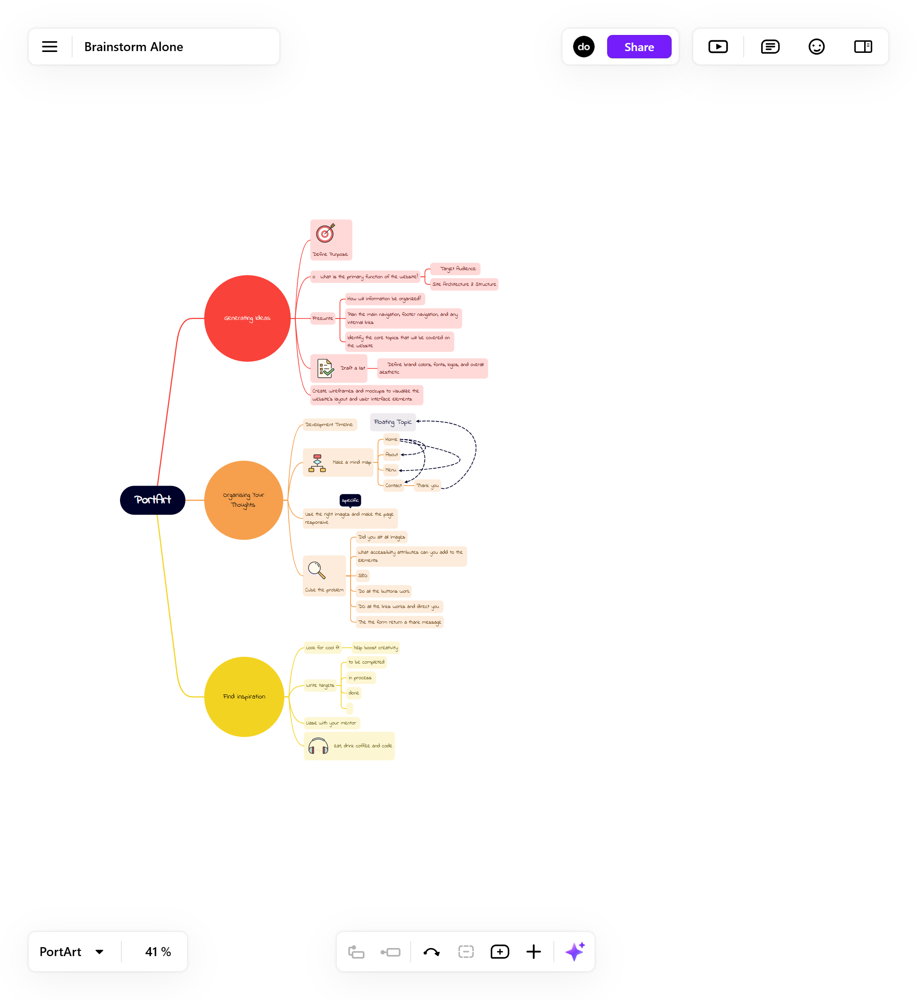

# PortArt

## About

PortArt is a restaurant made for people who want a journey into the heart of extraordinary flavours. It is a branding website that brings the essence and unique experience that casual dining can bring. The objective of the PortArt is and develop a sense of trust, aiming to get them as regular customers and attract new customers to make reservation.[This is my live link](https://dinacoding.github.io/PortArt/)

## Planning

- This mind map is the foundation for my "PortArt" restaurant website. I'm using it to visualize the entire user journey, from the moment someone lands on the homepage to when they make a reservation or explore our menu. The "PortArt," branches out into key sections like "About Us," "Menu," "Contact," and "Visit us". Each branch further subdivides into specific pages, considering factors like user flow and ease of navigation. For example, under "Menu," I've mapped out subsections for "starter," "Mains" and "Desserts". This mind map ensures a well-organized and intuitive website structure, making it easy for our guests to find the information they need and ultimately, choose to dine with PortArt.
Also how did I prioritise my workload and workflow.

- 

### Logo

- 

### Set Goals

1. Capture the attention of the user with high quality images and engaging content.
2. Make it simple the reservation process, making it easy for users to share the details
3. Transmit the venues brand and identity.
4. Deliver a memorable and unique exquisite gastronomic experience.

### Target Audience

- Food Enthusiasts & Connoisseurs
- Couples and Romantic Diners
- Business Professionals
- Local Community Members
- Venue hiring

## User Experience (UX)

### User Stories

- As a user, I want to feel that my expectaction will be meet.
- As a user, I want to have clear and updated information about the restaurant and fill the form booking form easily.
- As a user, I want to take someone special to a venue with a unique style.
- As a user, I want to use the website without the need to call the restaurant.

### How will I achieve this

- **Layout and media files** Adding engaging graphics and media to convey the identity and menu
- **Navigation and CTAs buttons** Easy to access buttons for the booking form.
- **Clear pieces of information** Organise a multi=page layout to guide users through headings and prioritise the content with colors for more important content.
- **Footer links** Social links and navigation links to enhance accessibility

### Sitemap Outline
1. Home
2. About
3. Menu
4. Contact
5. Thank You

### Wireframes

- **Home**:

1. [phone](images/wireframes-phone/landingpage.png)
2. [tablet](images/wireframes-table/tablet-landing.png)

- **About**:

1. [phone](images/wireframes-phone/phone-about.png)
2. [tablet](images/wireframes-table/tablet-about.png)

- **Menu**:

1. [phone](images/wireframes-phone/phone-menu.png)
2. [tablet](images/wireframes-table/tablet-menu.png)

- **Contact**:

1. [phone](images/wireframes-phone/phone-wireframe.png)
2. [tablet](images/wireframes-table/tablet-contact.png)

- **Thank You**

1. [phone](images/wireframes-phone/phone-thank.png)
2. [tablet](images/wireframes-table/tablet-thank.png)

### Screenshots 
 
- **Home Page**
   1. [phone](images/phone-PortArt-screenshots/phone-home.png)
   2. [tablet](images/tablet-PortArt-screenshots/table-home.png)
   3. [laptop](images/laptop-PortArt-screenshots/laptop-home.png)
- **About Page**
   1. [phone](images/phone-PortArt-screenshots/phone-about.png)
   2. [tablet](images/tablet-PortArt-screenshots/tablet-about.png)
   3. [laptop](images/laptop-PortArt-screenshots/laptop-about.png)
- **Menu Page**
   1. [phone](images/phone-PortArt-screenshots/phone-menu.png)
   2. [tablet](images/tablet-PortArt-screenshots/tablet-menu.png)
   3. [laptop](images/laptop-PortArt-screenshots/laptop-menu.png)
- **Contact Page**
   1. [phone](images/phone-PortArt-screenshots/phone.contact.png)
   2. [tablet](images/tablet-PortArt-screenshots/tablet-contact.png)
   3. [laptop](images/laptop-PortArt-screenshots/laptop-contact.png)

- **Thank you** 
   1. [phone](images/phone-PortArt-screenshots/phone-thank.png)
   2. [tablet](images/tablet-PortArt-screenshots/tablet-thank.png)
   3. [laptop](images/laptop-PortArt-screenshots/laptop-thank.png)

## Features

### Header

- **Logo**: Represents the Restaurant identity.

- **Navigation**: Navbar for different pages of the website
- **Hover effects** on the CTA buttons.
- **Toggle Button** for responsive mobile approach.

### Footer

- **Contact**: An easy access to contact.
- **About us**: link to pages detailing PortArt's story and philosophy.
- **social links**: Fast access to social media links.

## Features

### Website features

- **Hero Section**: A video and a CTA button with a large heading

- **Contact Form**: In the contact page

- **Links to another  pages**: Internal pages and external pages

- **Icons to social media profiles**: On the footer

## Designer Choices

### Color scheme

This color palette offers a sophisticated and versatile touch to the project and enhance the design. The bordeaux and a lighter shade provide a rich and elegant aspect while the beige and soft cream bring a sense of calm and neutrality. The charcoal gray and slate gray and the depth and subtle element. All together they create a balanced and harmonious look helping me achieving a polished work.

### Typography

The PortArt Restaurant website uses a combination of modern and classic fonts to create a refined and welcoming experience. Below are the details of each font used, along with its role and purpose on the site.

- Primary Font - Gothic A1 [Gothic A1](https://fonts.google.com/specimen/Gothic+A1)

- Secondary Font - [Urbanist](https://fonts.google.com/specimen/Urbanist)

- Body Font - [Lato](https://fonts.google.com/specimen/Lato)

- Accent Font - [Cormorant Garamond](https://fonts.google.com/specimen/Cormorant+Garamond)

## Technology used

- [HTML](https://developer.mozilla.org/en-US/docs/Web/HTML), for structure and content writting;
- [CSS](https://developer.mozilla.org/en-US/docs/Web/CSS), for styling and some visual effects;
- [Bootstrap](https://getbootstrap.com/), help me with the structuration and with the layout planning;
- [GoogleFonts](https://fonts.google.com/), use to import the fonts into my project;
- [Inkscape](https://inkscape.org/), to design the logo;
- [Canvas](https://www.canva.com/en_gb/), use to build the first and play around with the positioning;
- [Balsamiq](https://balsamiq.com/), used it to wireframe the webpages;
- [ChatGPT](https://chatgpt.com/), to use it to create content for the website and get me a color palette that would match with bordeaux and grey, to understand the structure of a readme.md and in the end to general code guidelines and best resources;
- [W3school] (https://www.w3schools.com/) to review some concepts about code;
- [Flexclip](https://www.flexclip.com/editor/app?id=e82a31633a9afd4158fb152727c086e3) to edit the video and add effects;
- [GoogleMaps](https://www.google.co.uk/maps/@52.8382004,-2.3278149,6z) for the iframe tag on the contact pages;
## Media

- [Pexels](https://www.pexels.com/) for the images.
- [Pixbay](https:https://pixabay.com/) for for images and videos.

=======

## Media Attributions

My sincere gratitude to the photographers who made their work available for free on Pexels. It wouldn't have been possible without you!The following images and videos are used under the Creative Commons license or with permission:

### Images and Credits

- **Fresh Vegetable Preparation**

  - Photo by Maarten van den Heuvel: [View on Pexels](https://www.pexels.com/photo/person-holding-sliced-vegetable-2284166/)

- **Restaurant Ambiance**

  - Photo by Kyle Lui: [View on Pexels](https://www.pexels.com/photo/photography-of-people-inside-a-restaurant-734562/)
  - Photo by Brett Sayles: [View on Pexels](https://www.pexels.com/photo/charming-outdoor-restaurant-evening-scene-in-boise-28497971/)
  - Photo by Volkan Vardar: [View on Pexels](https://www.pexels.com/photo/trendy-interior-of-cafe-with-creative-lamps-and-wooden-furniture-3887985/)

- **Dishes and Meals**

  - Fish Salad Dish - Photo by Dana Tentis: [View on Pexels](https://www.pexels.com/photo/fish-salad-dish-262959/)
  - French Fries - Photo by Sydney Troxell: [View on Pexels](https://www.pexels.com/photo/fries-with-leaves-dish-718742/)
  - French Macarons - Photo by Brigitte Tohm: [View on Pexels](https://www.pexels.com/photo/french-macarons-in-bowl-239581/)
  - Chocolate Cupcake - Photo by Max Griss: [View on Pexels](https://www.pexels.com/photo/chocolate-cupcake-with-white-icing-7013451/)

- **Menu and Ingredients**

  - Empty Clipboard with Fresh Vegetables and Herbs - Photo By Kaboompics.com: [View on Pexels](https://www.pexels.com/photo/empty-clipboard-with-fresh-vegetables-and-herbs-on-table-4033636/)

- **Wine**
  - Wine Glass - Photo by Aline Aronsky: [View on Pexels](https://www.pexels.com/photo/selected-focus-of-clear-wine-glass-1989164/)
  - Pouring Wine - Photo by Terje Sollie: [View on Pexels](https://www.pexels.com/photo/person-pouring-wine-on-clear-wine-glass-313715/)
  - Person Pouring Wine - Photo by Ksenia Chernaya: [View on Pexels](https://www.pexels.com/photo/person-pouring-wine-on-clear-wine-glass-3951670/)
  - Red Wine Glass - Photo by Posawee Suwannaphati: [View on Pexels](https://www.pexels.com/photo/wine-glass-with-red-wine-391213/)

### Video

And now for all the restaurant content creators for the videos, I edited them using [ ]

1. **Salmon cooking**

   - **Video by**: [cottonbro studio](https://www.pexels.com/@cottonbro/)
   - **Source**: [Pexels](https://www.pexels.com/video/salmon-in-a-pan-with-a-bit-of-water-3296399/)

2. **Restaurant landescape**

   - **Video by**: [Pavel Danilyuk](https://www.pexels.com/@pavel-danilyuk/)
   - **Source**: [Pexels](https://www.pexels.com/video/restaurant-landscape-businessman-man-7426708/)

3. **Presenting and holding a wine bottle**

   - **Video by**: [Pavel Danilyuk](https://www.pexels.com/@pavel-danilyuk/)
   - **Source**: [Pexels](https://www.pexels.com/video/a-man-talking-while-holding-a-wine-bottle-8764339/)

4. **Restaurant Interior Ambiance**

   - **Video by**: [Life-Of-Vids](https://pixabay.com/users/life-of-vids-1282862/?utm_source=link-attribution&utm_medium=referral&utm_campaign=video&utm_content=10878)
   - **Source**: [Pixabay](https://www.pixabay.com//?utm_source=link-attribution&utm_medium=referral&utm_campaign=video&utm_content=10878)

5. **Slicing Fried Salmon**

   - **Video by**: [宇航 钱](https://www.pexels.com/@宇航-钱-139999838/)
   - **Source**: [Pexels](https://www.pexels.com/video/slicing-fried-salmon-12409707/)

6. **Pouring Sauce on Food**

   - **Video by**: [Taryn Elliott](https://www.pexels.com/@taryn-elliott/)
   - **Source**: [Pexels](https://www.pexels.com/video/person-pouring-sauce-on-food-3769033/)

7. **Serving Soybean Pods**

   - **Video by**: [cottonbro studio](https://www.pexels.com/@cottonbro/)
   - **Source**: [Pexels](https://www.pexels.com/video/a-serving-of-cooked-soybean-pod-in-a-bowl-3298718/)

8. **Smiling Man in White Shirt**

   - **Video by**: [Jack Sparrow](https://www.pexels.com/@jack-sparrow/)
   - **Source**: [Pexels](https://www.pexels.com/video/man-in-white-long-sleeves-sitting-while-happily-looking-at-the-camera-5989765/)

9. **Taking a Photo of a Plated Dish**
   - **Video by**: [cottonbro studio](https://www.pexels.com/@cottonbro/)
   - **Source**: [Pexels](https://www.pexels.com/video/a-person-taking-photo-of-a-plated-dish-using-a-smart-phone-3296572/)

### Code references

- The following code snippet demonstrates the use of the `<address>` HTML tag to display contact information. This code was adapted from [W3Schools](https://www.w3schools.com/tags/tag_address.asp)

- The following code represents a footer section of a webpage. It includes a navigation menu, some text, and social media links. [Reed](https://www.reed.co.uk/courses/course-player/build-amazing-websites-w-html-css-sass-javascript-more/17-creating-the-footer/315607/24319**/)

## Code Validator

### HTML validator 
- [Home](validator/w3c-home.png)
- [About](validator/w3c-about.png)
- [Menu](validator/w3c-menu.png)
- [Contact](validator/w3c-contact.png)
- [Thank](validator/w3c-thank.png)

### CSS validator
- [CSS](validator/w3c-css.png)

## Testing

### Lighthouse 
**Home**
- [Phone](lighthouse/sm-home-testing.png)
- [Desktop](lighthouse/lg-home-testing.png)

**About**
- [Phone](lighthouse/sm-about-testing.png)
- [Desktop](lighthouse/lg-about-testing.png)

**Menu**
- [Phone](lighthouse/sm-menu-testing.png)
- [Desktop](lighthouse/lg-menu-testing.png)

**Contact**
- [Phone](lighthouse/sm-contact-testing.png)
- [Desktop](lighthouse/lg-contact-testing.png)

**Thank You**
- [Phone](lighthouse/sm-thank-testing.png)
- [Desktop](lighthouse/lg-thank-testing.png)

This structure provides clear differentiation for phone and desktop testing for each section and the website it is responsive in Safari, Mozilla, Microsoft Edge and Chrome

## Functionality testing 

| **Description of Test**                                         | **Passed (Yes/No)** | **Notes or Comments**                                                       |
|------------------------------------------------------------------|---------------------|----------------------------------------------------------------------------|
| Meta Tags are descriptive and they are present in every file page| Yes                 | They are present and cohesive.                                              |
| Logo returns to the homepage                                     | Yes                 | Everything worked as expected.                                              |
| Navbar opens the respective page                                 | Yes                 | It didn't show any major issues.                                           |
| Hover effect on the Navbar Links                                 | Yes                 | Works fine under all conditions.                                           |
| Responsive and Rescalable Images                                 | Yes                 | Good resolution and adapts to different screen sizes.                       |
| Test Bootstrap grid system functionality                         | Yes                 | Layout remains intact at all breakpoints (desktop, tablet, and mobile).     |
| Test navigation bar toggle functionality                         | Yes                 | Hamburger menu opens and closes on mobile devices.                          |
| Verify footer links                                              | Yes                 | Footer links redirect to the correct pages and social media platforms.      |
| Test cross-browser compatibility                                 | Yes                 | Verified on Chrome, Safari, Edge, and Firefox without issues.               |
| Test video autoplay and controls functionality                   | Yes                 | Video auto-plays, and controls work as expected.                            |
| Ensure video has an accessible fallback text                     | Yes                 | Fallback text is provided for unsupported browsers.                         |
| Check favicon display in browser tabs                            | Yes                 | All favicon sizes load properly across multiple browsers.                   |
| Verify SEO meta tags for accuracy                                | Yes                 | Meta tags (description, keywords) are descriptive and relevant.             |
| Check social media links                                         | Yes                 | Links open respective social platforms in a new tab.                        |
| Ensure copyright text displays correctly                         | Yes                 | Footer includes "Dinacoding Produced this website" text.                    |
| Test call-to-action button functionality                         | Yes                 | Button redirects to `menu.html`.                                            |
| Test call-to-action button functionality                         | Yes                 | Button redirects to `contact.html`.                                         |
| Verify semantic HTML usage                                       | Yes                 | Sections and content are wrapped in semantic `<section>` and `
` tags. |
| Ensure all external resources load correctly                     | Yes                 | Bootstrap, FontAwesome, and custom CSS/JS load without issues.              |
| Test performance using Google Lighthouse                         | Yes                 | Performance score is above 70; need to optimize images and reduce blocking resources. |
| Ensure text and image alignment                                  | Yes                 | Text aligns correctly with corresponding images across breakpoints.         |
| Check responsiveness of section                                  | Yes                 | Layout adjusts seamlessly across different screen sizes.                    |
| A form for users to make an enquiry, asking for their comment or question. | Yes           | Test form submission to ensure it redirects to the "thank.html" page. Test textarea functionality. |
| Displays the restaurant address along with an embedded Google Map of the location. | Yes | Test the map display and verify the address details for accuracy.            |
| A reservation form to make bookings, collecting name, email, guest count, date, and time. | Yes | Test form submission to ensure it redirects correctly. Check input validation for all fields. |
| Displays a message thanking the user for their booking and a call to action to return to the home page. | Yes | Ensure the "Thank You" message is displayed correctly and the button redirects to the home page. |
Initial state of video and play button                        | On page load, the video is paused, and the play button displays the `playIcon`.                                        | Yes                 | Verified during initial load.                    |
| Play button toggles video play/pause state                | Clicking the play button:   - Plays the video if it is paused.   - Pauses the video if it is playing.             | Yes                 | The button icon updates to `pauseIcon` or `playIcon` correctly. |
| Direct video click toggles play/pause state**                   | Clicking directly on the video element:   - Plays the video if it is paused.   - Pauses the video if it is playing. | Yes                 | Button icon also updates accordingly.            |
| Play button resets to play icon when video ends**               | After the video finishes playing (fires `ended` event), the play button updates to display the `playIcon`.             | Yes                 | The icon resets as expected.                     |

## Deployment

To deploy this project to GitHub Pages, the following steps were taken:

1. Log into GitHub.
2. From the list of repositories, select [https://github.com/Dinacoding/PortArt].
3. From the menu at the top of the repository page, select Settings.
4. Scroll down to the GitHub Pages section.
5. Under Source, click the drop-down menu labeled None and select Master Branch
6. Once selected, the page will automatically refresh, and the website will be deployed
7. Scroll back down to the GitHub Pages section to retrieve the link to the live website

### How to run this project locally 

1. Download the Git installer:

Windows:

Go to the official Git website: https://git-scm.com/
Click on the "Download for Windows" button.
Run the downloaded installer.
Follow the on-screen instructions. It's generally recommended to use the default options during installation.
macOS:

The easiest way is to use Homebrew:
Open Terminal.
Type brew install git and press Enter.
If you don't have Homebrew, install it first using the instructions on their website: https://brew.sh/
Linux:

Git is usually available through your distribution's package manager.
For Ubuntu/Debian, use sudo apt update and then sudo apt install git.
For Fedora/CentOS, use sudo dnf install git.
For Arch Linux, use pacman -S git.
2. Verify installation:

Open your terminal or command prompt.
Type git --version and press Enter.
If Git is installed correctly, you'll see the installed Git version displayed.

### To clone this project from GitHub:

1. Follow this link to the Project GitHub repository.
2. Under the repository name, click "Clone or download."
3. In the "Clone with HTTPS" section, copy the clone URL for the repository.
4. In your local IDE, open Git Bash.
5. Change the current working directory to the location where you want the cloned directory to be made.
6. Type git clone, and then paste the URL you copied in Step 3.

## Features Left to Implement

- Create a venue hiring section
- Style the input submit button on the first form on the contact.html file 

## Future improvements or enhancements 
- Colaborate with designers and implement in order to bring the max potential of the website design
- Enchance overall the website performance and ratings

[This is my live project](https://dinacoding.github.io/PortArt/)

[def]: https://dinacoding.github.io/PortArt/git

