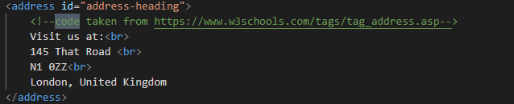
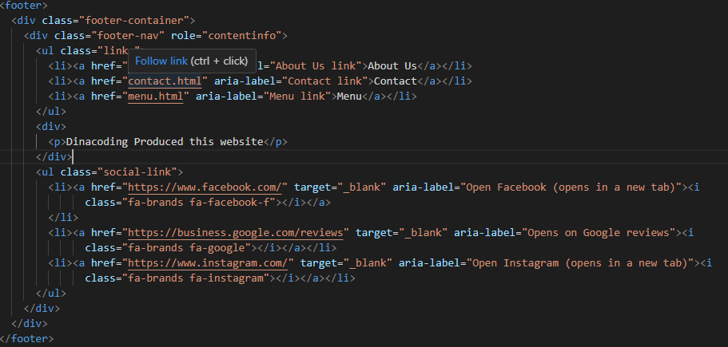

# PortArt

## About

PortArt is a restaurant made for people who want a journey into the heart of extraordinary flavours. It is a branding website that brings the essence and unique experience that casual dining can bring. The objective of the PortArt is and develop a sense of trust, aiming to get them as regular customers and attract new customers to make reservation.[This is my live link](https://dinacoding.github.io/PortArt/)

## Planning

### Logo

- 

### Set Aims

1. Capture the attention of the user with high quality images and engaging content.
2. Make it simple the reservation process, making it easy for users to share the details
3. Transmit the venues brand and identity.
4. Deliver a memorable and unique exquisite gastronomic experience.

### Target Audience

- Food Enthusiasts and Connoisseurs
- Couples and Romantic Diners
- Business Professionals
- Local Community Members
- Venue hiring

## User Experience (UX)

### User Stories

- I want to feel that my expectaction will be meet
- Find the form easily
- I wish I could take someone special there today
- Information should be displayed on the website without the need to call
- Help the business to contact the customers and guide them to

### How will I achieve this

- **Layout and media files** Adding engaging graphics and media to convey the identity and menu
- **Navigation and CTAs buttons** Easy to access buttons for the booking form.
- **Clear pieces of information** Organise a multipage layout to guide users with through headings and prioritise the content with colors for more important content.
- **Footer links** Social links and navigation links to enhance accessibility

### Sitemap Outline
1. Home
2. About
3. Menu
4. Contact
5. Thank You

### Wireframes

- **Home**:

1. [phone](images/wireframes-phone/landingpage.png)
2. [tablet](images/wireframes-table/tablet-landing.png)

- **About**:

1. [phone](images/wireframes-phone/phone-about.png)
2. [tablet](images/wireframes-table/tablet-about.png)

- **Menu**:

1. [phone](images/wireframes-phone/phone-menu.png)
2. [tablet](images/wireframes-table/tablet-menu.png)

- **Contact**:

1. [phone](images/wireframes-phone/phone-wireframe.png)
2. [tablet](images/wireframes-table/tablet-contact.png)

- **Thank You**

1. [phone](images/wireframes-phone/phone-thank.png)
2. [tablet](images/wireframes-table/tablet-thank.png)

### Screenshots 
 
- **Home Page**
   1. [phone](images/phone-PortArt-screenshots/phone-home.png)
   2. [tablet](images/tablet-PortArt-screenshots/table-home.png)
   3. [laptop](images/laptop-PortArt-screenshots/laptop-home.png)
- **About Page**
   1. [phone](images/phone-PortArt-screenshots/phone-about.png)
   2. [tablet](images/tablet-PortArt-screenshots/tablet-about.png)
   3. [laptop](images/laptop-PortArt-screenshots/laptop-about.png)
- **Menu Page**
   1. [phone](images/phone-PortArt-screenshots/phone-menu.png)
   2. [tablet](images/tablet-PortArt-screenshots/tablet-menu.png)
   3. [laptop](images/laptop-PortArt-screenshots/laptop-menu.png)
- **Contact Page**
   1. [phone](images/phone-PortArt-screenshots/phone.contact.png)
   2. [tablet](images/tablet-PortArt-screenshots/tablet-contact.png)
   3. [laptop](images/laptop-PortArt-screenshots/laptop-contact.png)

- **Thank you** 
   1. [phone](images/phone-PortArt-screenshots/phone-thank.png)
   2. [tablet](images/tablet-PortArt-screenshots/tablet-thank.png)
   3. [laptop](images/laptop-PortArt-screenshots/laptop-thank.png)

## Features

### Header

- **Logo**: Represents the Restaurant identity.

- **Navigation**: Navbar for different pages of the website
- **Hover effects** on the CTA buttons.
- **Toggle Button** for responsive mobile approach.

### Footer

- **Contact**: An easy access to contact.
- **About us**: link to pages detailing PortArt's story and philosophy.
- **social links**: Fast access to social media links.

## Features

### Website features

- **Hero Section**: A video and a CTA button with a large heading

- **Contact Form**: In the contact page

- **Links to another  pages**: Internal pages and external pages

- **Icons to social media profiles**: On the footer

## Designer Choices

### Color scheme

This color palette offers a sophisticated and versatile touch to the project and enhance the design. The bordeaux and a lighter shade provide a rich and elegant aspect while the beige and soft cream bring a sense of calm and neutrality. The charcoal gray and slate gray and the depth and subtle element. All together they create a balanced and harmonious look helping me achieving a polished work.

### Typography

The PortArt Restaurant website uses a combination of modern and classic fonts to create a refined and welcoming experience. Below are the details of each font used, along with its role and purpose on the site.

- Primary Font - Gothic A1 [Gothic A1](https://fonts.google.com/specimen/Gothic+A1)

- Secondary Font - [Urbanist](https://fonts.google.com/specimen/Urbanist)

- Body Font - [Lato](https://fonts.google.com/specimen/Lato)

- Accent Font - [Cormorant Garamond](https://fonts.google.com/specimen/Cormorant+Garamond)

## Technology used

- [HTML](https://developer.mozilla.org/en-US/docs/Web/HTML), for structure and content writting;
- [CSS](https://developer.mozilla.org/en-US/docs/Web/CSS), for styling and some visual effects;
- [Bootstrap](https://getbootstrap.com/), help me with the structuration and with the layout planning;
- [GoogleFonts](https://fonts.google.com/), use to import the fonts into my project;
- [Inkscape](https://inkscape.org/), to design the logo;
- [Canvas](https://www.canva.com/en_gb/), use to build the first and play around with the positioning;
- [Balsamiq](https://balsamiq.com/), used it to wireframe the webpages;
- [ChatGPT](https://chatgpt.com/), to use it to create content for the website and get me a color palette that would match with bordeaux and grey, to understand the structure of a readme.md and in the end to general code guidelines and best resources;
- [W3school] (https://www.w3schools.com/) to review some concepts about code;
- [Flexclip](https://www.flexclip.com/editor/app?id=e82a31633a9afd4158fb152727c086e3) to edit the video and add effects;
- [GoogleMaps](https://www.google.co.uk/maps/@52.8382004,-2.3278149,6z) for the iframe tag on the contact pages;
## Media

- [Pexels](https://www.pexels.com/) for the images.
- [Pixbay](https:https://pixabay.com/) for for images and videos.

=======

## Media Attributions

Cheers to and my gratitude to the photographers who made their work available for free on Pexels, it would have been dreadful without you!

### Images and Credits

- **Fresh Vegetable Preparation**

  - Photo by Maarten van den Heuvel: [View on Pexels](https://www.pexels.com/photo/person-holding-sliced-vegetable-2284166/)

- **Restaurant Ambiance**

  - Photo by Kyle Lui: [View on Pexels](https://www.pexels.com/photo/photography-of-people-inside-a-restaurant-734562/)
  - Photo by Brett Sayles: [View on Pexels](https://www.pexels.com/photo/charming-outdoor-restaurant-evening-scene-in-boise-28497971/)
  - Photo by Volkan Vardar: [View on Pexels](https://www.pexels.com/photo/trendy-interior-of-cafe-with-creative-lamps-and-wooden-furniture-3887985/)

- **Dishes and Meals**

  - Fish Salad Dish - Photo by Dana Tentis: [View on Pexels](https://www.pexels.com/photo/fish-salad-dish-262959/)
  - French Fries - Photo by Sydney Troxell: [View on Pexels](https://www.pexels.com/photo/fries-with-leaves-dish-718742/)
  - French Macarons - Photo by Brigitte Tohm: [View on Pexels](https://www.pexels.com/photo/french-macarons-in-bowl-239581/)
  - Chocolate Cupcake - Photo by Max Griss: [View on Pexels](https://www.pexels.com/photo/chocolate-cupcake-with-white-icing-7013451/)

- **Menu and Ingredients**

  - Empty Clipboard with Fresh Vegetables and Herbs - Photo By Kaboompics.com: [View on Pexels](https://www.pexels.com/photo/empty-clipboard-with-fresh-vegetables-and-herbs-on-table-4033636/)

- **Wine**
  - Wine Glass - Photo by Aline Aronsky: [View on Pexels](https://www.pexels.com/photo/selected-focus-of-clear-wine-glass-1989164/)
  - Pouring Wine - Photo by Terje Sollie: [View on Pexels](https://www.pexels.com/photo/person-pouring-wine-on-clear-wine-glass-313715/)
  - Person Pouring Wine - Photo by Ksenia Chernaya: [View on Pexels](https://www.pexels.com/photo/person-pouring-wine-on-clear-wine-glass-3951670/)
  - Red Wine Glass - Photo by Posawee Suwannaphati: [View on Pexels](https://www.pexels.com/photo/wine-glass-with-red-wine-391213/)

### Video

And now for all the restaurant content creators for the videos, I edited them using [ ]

1. **Salmon cooking**

   - **Video by**: [cottonbro studio](https://www.pexels.com/@cottonbro/)
   - **Source**: [Pexels](https://www.pexels.com/video/salmon-in-a-pan-with-a-bit-of-water-3296399/)

2. **Restaurant landescape**

   - **Video by**: [Pavel Danilyuk](https://www.pexels.com/@pavel-danilyuk/)
   - **Source**: [Pexels](https://www.pexels.com/video/restaurant-landscape-businessman-man-7426708/)

3. **Presenting and holding a wine bottle**

   - **Video by**: [Pavel Danilyuk](https://www.pexels.com/@pavel-danilyuk/)
   - **Source**: [Pexels](https://www.pexels.com/video/a-man-talking-while-holding-a-wine-bottle-8764339/)

4. **Restaurant Interior Ambiance**

   - **Video by**: [Life-Of-Vids](https://pixabay.com/users/life-of-vids-1282862/?utm_source=link-attribution&utm_medium=referral&utm_campaign=video&utm_content=10878)
   - **Source**: [Pixabay](https://www.pixabay.com//?utm_source=link-attribution&utm_medium=referral&utm_campaign=video&utm_content=10878)

5. **Slicing Fried Salmon**

   - **Video by**: [宇航 钱](https://www.pexels.com/@宇航-钱-139999838/)
   - **Source**: [Pexels](https://www.pexels.com/video/slicing-fried-salmon-12409707/)

6. **Pouring Sauce on Food**

   - **Video by**: [Taryn Elliott](https://www.pexels.com/@taryn-elliott/)
   - **Source**: [Pexels](https://www.pexels.com/video/person-pouring-sauce-on-food-3769033/)

7. **Serving Soybean Pods**

   - **Video by**: [cottonbro studio](https://www.pexels.com/@cottonbro/)
   - **Source**: [Pexels](https://www.pexels.com/video/a-serving-of-cooked-soybean-pod-in-a-bowl-3298718/)

8. **Smiling Man in White Shirt**

   - **Video by**: [Jack Sparrow](https://www.pexels.com/@jack-sparrow/)
   - **Source**: [Pexels](https://www.pexels.com/video/man-in-white-long-sleeves-sitting-while-happily-looking-at-the-camera-5989765/)

9. **Taking a Photo of a Plated Dish**
   - **Video by**: [cottonbro studio](https://www.pexels.com/@cottonbro/)
   - **Source**: [Pexels](https://www.pexels.com/video/a-person-taking-photo-of-a-plated-dish-using-a-smart-phone-3296572/)

### Code references

- The following code snippet demonstrates the use of the `<address>` HTML tag to display contact information. This code was adapted from [W3Schools](https://www.w3schools.com/tags/tag_address.asp)

- The following code represents a footer section of a webpage. It includes a navigation menu, some text, and social media links. [Reed](https://www.reed.co.uk/courses/course-player/build-amazing-websites-w-html-css-sass-javascript-more/17-creating-the-footer/315607/24319**/)

## Code Validator

### HTML validator 
- [Home](validator/w3c-home.png)
- [About](validator/w3c-about.png)
- [Menu](validator/w3c-menu.png)
- [Contact](validator/w3c-contact.png)
- [Thank](validator/w3c-thank.png)

### CSS validator
- [CSS](validator/w3c-css.png)

## Testing

### Lighthouse 
**Home**
- [Phone](lighthouse/sm-home-testing.png)
- [Desktop](lighthouse/lg-home-testing.png)

**About**
- [Phone](lighthouse/sm-about-testing.png)
- [Desktop](lighthouse/lg-about-testing.png)

**Menu**
- [Phone](lighthouse/sm-menu-testing.png)
- [Desktop](lighthouse/lg-menu-testing.png)

**Contact**
- [Phone](lighthouse/sm-contact-testing.png)
- [Desktop](lighthouse/lg-contact-testing.png)

**Thank You**
- [Phone](lighthouse/sm-thank-testing.png)
- [Desktop](lighthouse/lg-thank-testing.png)

This structure provides clear differentiation for phone and desktop testing for each section and the website it is responsive in Mozilla, Microsoft Edge and Chrome

## Functionality testing 

| Description of Test      | Passed (Yes/No) | Notes or Comments            |
|--------------------------|-----------------|------------------------------|
| Logo returns to the homepage | Yes             | Everything worked as expected |
| Navbar opens the respective page | Yes         | It didn't show any major issues |
| Hover effect on the Navbar Links | Yes             | Works fine under all conditions |
| Resposive and Rescalabe Images | Yes           | Good resolution and enhances to different screensizes|
| Test Bootstrap grid system functionality | Yes | Layout remains intact at all breakpoints (desktop, tablet, and mobile).  |

## Features Left to Implement

- Create a venue hiring section
- Style the input submit button on the first form on the contact.html file 

## Future improvements or enhancements 
- Colaborate with designers and implement in order to bring the max potential of the website design
- Enchance overall the website performance and ratings

[This is my live project](https://dinacoding.github.io/PortArt/)

[def]: https://dinacoding.github.io/PortArt/git

