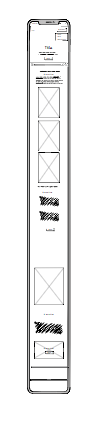
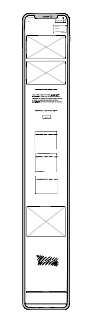
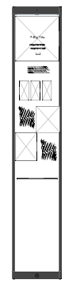
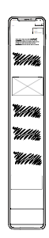
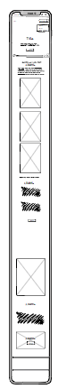
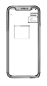

# PortArt

## About
PortArt is a restaurant made for people who want  a journey into the heart of extraordinary flavours. It is a branding website that brings the essence and unique experience that casual dining can bring. The objective of the PortArt Restaurant is to provide to the user a clear vision of what the brand PortArt is and develop a sense of trust, aiming to get them as customers and make a reservation.[This is my live link](https://dinacoding.github.io/PortArt/)

## Planning
### Set Aims
1. Capture the attention of the user with high quality images and engaging content.
2. Make it simple the reservation process, making it easy for users to share the details
3. Transmit the venues brand and identity.
4. Deliver a memorable and unique exquisite gastronomic experience.

### Target Audience 
- Couples celebrating special dates
- Digital influencers
- Group Bookings
- Business meetings
- Venue hiring

## User Experience (UX)

### User Stories
- I want to feel that my expectaction will be meet
- Find the form easily
- I wish I could take someone special there today
- Information should be displayed on the website without the need to call

### How will I achieve this 
- **Layout and media files** Adding engaging graphics and media to convey the identity and menu
- **Navigation and CTAs buttons** Easy to access buttons for the booking form.
- **Clear pieces of information** Organise a multipage layout to guide users with through headings and prioritise the content with colors for more important content.
- **Footer links** Social links and navigation links to enhance accessibility

### Wireframes
- **Home**:
1. 
2. 
3. 

- **About**:
1. 
2. 
3. Laptop

- **Menu**:
1. 
2. [tablet](images/wireframes-table/tablet-landing.png)
3. Laptop

- **Contact**:
1. 
2. [tablet](images/wireframes-table/tablet-landing.png)
3. Laptop

- **Thank You**
1. 
2. [tablet](images/wireframes-table/tablet-landing.png)
3. Laptop

## Features
### Header
- **Logo**: Represents the Restaurant identity.
- **Navigation**: Navbar for different pages of the website
- **Hover effects** on the CTA buttons.
- **Toggle Button** for responsive mobile approach.

![]

### Footer
- **Contact**: An easy access to contact.
- **About us**: link to pages detailing PortArt's story and philosophy.
- **social links**: Fast access to social media links.

## Page features
### Home 
- **Hero Section**: A video  and a CTA button with a large heading

![]

## Designer Choices

### Color scheme
This color palette offers a sophisticated and versatile touch to the project and enhance the design. The bordeaux and a lighter shade provide a rice and elegant aspect while the beige and soft cream bring a sense of calm and neutrality. The charcoal gray and slate gray and the depth and subtle element. All together they create a balanced and harmonious look helping me achieving a polished work.

### Typography

## Technology used
- [HTML](https://developer.mozilla.org/en-US/docs/Web/HTML), for structure and content writting.
- [CSS](https://developer.mozilla.org/en-US/docs/Web/CSS), for styling and some visual effects.
- [Bootstrap](https://getbootstrap.com/), help me with the structuration and with the layout planning.
- [GoogleFonts](https://fonts.google.com/), use to import the fonts into my project
- [Inkscape](https://inkscape.org/), to design the logo;
- [Canvas](https://www.canva.com/en_gb/), use to build the first and play around with the positioning.
- [Balsamiq](https://balsamiq.com/)

## Media

- [Pexels](https://www.pexels.com/) for the images.
- [Favicon converter](https://favicon.io/favicon-converter/) to generate favicons from an image we borrowed from [pexels](https://www.pinclipart.com/maxpin/oRmTTb/).
=======

## Media Attributions

We would like to extend our heartfelt gratitude to the photographers who made their work available for free on Pexels. The beauty and professionalism of their images have significantly enhanced the look and feel of this website. 

### Images and Credits

- **Fresh Vegetable Preparation**
  - Photo by Maarten van den Heuvel: [View on Pexels](https://www.pexels.com/photo/person-holding-sliced-vegetable-2284166/)

- **Restaurant Ambiance**
  - Photo by Kyle Lui: [View on Pexels](https://www.pexels.com/photo/photography-of-people-inside-a-restaurant-734562/)
  - Photo by Brett Sayles: [View on Pexels](https://www.pexels.com/photo/charming-outdoor-restaurant-evening-scene-in-boise-28497971/)
  - Photo by Volkan Vardar: [View on Pexels](https://www.pexels.com/photo/trendy-interior-of-cafe-with-creative-lamps-and-wooden-furniture-3887985/)

- **Dishes and Meals**
  - Fish Salad Dish - Photo by Dana Tentis: [View on Pexels](https://www.pexels.com/photo/fish-salad-dish-262959/)
  - French Fries - Photo by Sydney Troxell: [View on Pexels](https://www.pexels.com/photo/fries-with-leaves-dish-718742/)
  - French Macarons - Photo by Brigitte Tohm: [View on Pexels](https://www.pexels.com/photo/french-macarons-in-bowl-239581/)
  - Chocolate Cupcake - Photo by Max Griss: [View on Pexels](https://www.pexels.com/photo/chocolate-cupcake-with-white-icing-7013451/)

- **Menu and Ingredients**
  - Empty Clipboard with Fresh Vegetables and Herbs - Photo By Kaboompics.com: [View on Pexels](https://www.pexels.com/photo/empty-clipboard-with-fresh-vegetables-and-herbs-on-table-4033636/)

- **Wine**
  - Wine Glass - Photo by Aline Aronsky: [View on Pexels](https://www.pexels.com/photo/selected-focus-of-clear-wine-glass-1989164/)
  - Pouring Wine - Photo by Terje Sollie: [View on Pexels](https://www.pexels.com/photo/person-pouring-wine-on-clear-wine-glass-313715/)
  - Person Pouring Wine - Photo by Ksenia Chernaya: [View on Pexels](https://www.pexels.com/photo/person-pouring-wine-on-clear-wine-glass-3951670/)
  - Red Wine Glass - Photo by Posawee Suwannaphati: [View on Pexels](https://www.pexels.com/photo/wine-glass-with-red-wine-391213/)
### 
[This is my live project][def]

[def]: https://dinacoding.github.io/PortArt/gi
